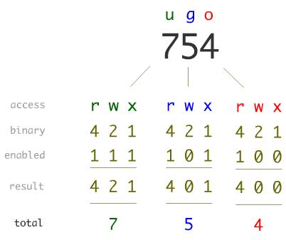

# Linux Basics

*Click  if you like the project. Pull Request are highly appreciated.*

<br/>

## Table of Contents

| No. | Topic                                                                   |
| --- | ----------------------------------------------------------------------- |
| 1   | [**User Information**](#user-information)                               |
| 2   | [**File and Directory Commands**](#file-and-directory-commands)         |
| 3   | [**File Permissions**](#file-permissions)                               |
| 4   | [**Networking**](#networking)                                           |
| 5   | [**Installing Packages**](#installing-packages)                         |
| 6   | [**Disk Usage**](#disk-usage)                                           |
| 7   | [**System and Hardware Information**](#system-and-hardware-information) |
| 8   | [**Search Files**](#search-files)                                       |
| 9   | [**SSH**](#ssh)                                                         |
| 10  | [**Vi Editor**](#vi-editor)                                             |
| 11  | [**Bash Script**](#bash-script)                                         |

## User Information

* **who** It is used to get information about currently logged in user on to system. If you don\'t provide any option or arguments, the command displays the following information for each logged-in user.

    1. Login name of the user
    2. User terminal
    3. Date & Time of login
    4. Remote host name of the user

```bash
$ who
admin    tty2         2022-02-10 01:36 (tty2)
root     pts/1        2022-02-15 00:29 (10.190.95.154)
```

* **whoami:** It display the system’s username

```bash
$ whoami
Avani Punita
```

* **id:** It display the user identification ( the real and effective user and group IDs ) information

```bash
$ id
uid=1000(sj) gid=1000(sj) groups=1000(sj),4(adm),24(cdrom),27(sudo),30(dip),46(plugdev),120(lpadmin),131(lxd),132(sambashare)
```

* **groups:** This command is used to display all the groups for which the user belongs to.

```bash
$ group
sj: sj, adm, cdrom, sudo, dip, plugdev, lpadmin, lxd, sambashare
```

* **users:** Displays usernames of all users currently logged on the system.

```bash
$ users
root
```

* **grep:** It  is a powerful pattern searching tool to find information about a specific user from the system accounts file: /etc/passwd.

```cmd
$ grep -i sj /etc/passwd
sj:x:1000:1000:sj,,,:/home/sj:/bin/bash
```

* **W Command:** It(W) is a command-line utility that displays information about currently logged in users and what each user is doing.

```bash
w [OPTIONS] [USER]
Example:
w
 18:45:04 up  2:09,  1 user,  load average: 0.09, 0.07, 0.02
USER     TTY      FROM             LOGIN@   IDLE   JCPU   PCPU WHAT
sj       :0       :0               01:27   ?xdm?   1:14   0.01s /usr/lib/gdm3/g
```

* **last or lastb:** Displays a list of last logged in users on the system. You can pass user names to display their login and hostname details.

```bash
last [options] [username...] [tty...]

Example:

root     pts/1        xx.xxx.xx.xxx    Tue Feb 15 00:29   still logged in
root     pts/2        xx.xxx.xx.xxx    Mon Feb 14 03:45 - 06:59  (03:13)
root     pts/1        xx.xxx.xx.xxx    Mon Feb 14 01:21 - 04:35  (03:13)
root     pts/1        xx.xxx.xx.xxx    Sun Feb 13 21:28 - 00:43  (03:15)
root     pts/1        xx.xxx.xx.xxx    Sun Feb 13 09:46 - 10:20  (00:33)
root     pts/1        xx.xxx.xx.xxx    Sat Feb 12 21:30 - 23:44  (02:13)
root     pts/1        xx.xxx.xx.xxx    Sat Feb 12 11:15 - 11:56  (00:40)
root     pts/1        xx.xxx.xx.xxx    Sat Feb 12 11:08 - 11:15  (00:06)
root     pts/1        xx.xxx.xx.xxx    Sat Feb 12 02:06 - 05:19  (03:12)
```

* **lastlog:** The `lastlog` command is used to find the details of a recent login of all users or of a given user.

```bash
$ lastlog

Username         Port     From             Latest
root             pts/1    xx.xxx.xx.xxx    Tue Feb 15 00:29:27 -0500 2022
daemon                                     **Never logged in**
bin                                        **Never logged in**
sys                                        **Never logged in**
sync                                       **Never logged in**
games                                      **Never logged in**
man                                        **Never logged in**
lp                                         **Never logged in**
mail                                       **Never logged in**
news                                       **Never logged in**
```

<div align="right">
  <b><a href="#">↥ back to top</a></b>
</div>

## File and Directory Commands

1. **pwd** The pwd ( Present Working Directory ) command is used to print the name of the present/current working directory starting from the root.

```bash
$ pwd
/home/sj/Desktop/Linux
```

2. **mkdir** The mkdir ( make directory ) command allows users to create directories or folders.

```bash
$ mkdir ubuntu
$ ls
ubuntu
```

The option '-p' is used to create multiple directories or parent directories at once.

```bash
$ mkdir -p dir1/dir2/dir3
$ cd dir1/dir2/dir3
~/Desktop/Linux/dir1/dir2/dir3$
```

3. **rmdir**: The rmdir ( remove directories ) is used to remove _empty_ directories. Can be used to delete multiple empty directories as well. Safer to use compared to `rm -r FolderName`. This command can also be forced to delete non-empty directories.

   1. Remove empty directory:

```bash
rmdir FolderName
```

   2. Remove multiple directories:

```bash
rmdir FolderName1 FolderName2 FolderName3
```

   3. Remove non-empty directories:

```bash
rmdir FolderName1 --ignore-fail-on-non-empty
```

   4. Remove entire directory tree. This command is similar to `rmdir a/b/c a/b a`:

```bash
rmdir -p a/b/c
```

4. **rm**: The rm ( remove ) command is used to remove objects such as files, directories, symbolic links etc from the file system.
   1. Remove file: The rm command is used to remove or delete a file

```bash
rm file_name
```

2. Remove file forcefully: The rm command with -f option is used for removal of file without prompting for confirmation.

```bash
rm -f filename
```

3. Remove directory: The rm command with -r option is used to remove the directory and its contents recursively.

```bash
rm -r myDir
```

4. Remove directory forcefully: The rm command with -rf option is used to forcefully remove directory recursively.

```bash
rm -rf myDir
```

5. **touch**: The touch command is is used to create, change and modify timestamps of a file without any content.
   1. **Create a new file:** You can create a single file at a time using touch command. The file created is an empty file.
       ```bash
       touch file_name
       ```
   2. **Create multiple files:** You can create the multiple numbers of files at the same time.
       ```bash
       touch file1_name file2_name file3_name
       ```
   3. **Change access time:** The touch command with `a` option is used to change the access time of a file.
       ```bash
       touch -a file_name
       ```
   4. **Change modification time:** The touch command with `m` option is used to change the modified time.
       ```bash
       touch -m file_name
       ```
   5. **Use timestamp of other file:** The touch command with `r` option is used to get timestamp of another file.
       ```bash
       touch -r file2 file1
       ```

       In the above example, we get the timestamp of file1 for file2.

   6. **Create file with Specific time:** The touch command with 't' option is used to create a file with specified time.
       ```bash
       touch -t 1911010000 file_name
       ```
6. **cat**: The cat command is used to create single or multiple files, view contain of file, concatenate files and redirect output in terminal or files.

   1. **View file contents:** You can view contents of a single or more files by mentioning the filenames.

       ```bash
       cat file_name1 file_name2
       ```

## File Commands

|Sl.No.| Commands    | Description              |
|------|-------------|--------------------------|
|  01.  |ls         | directory listing|
|  02.  |ls -al     | formatted listing with hidden files|
|  03.  |cd dir     |change directory to dir|
|  04.  |cd         | change to home|
|  05.  |pwd        | show current directory|
|  06.  |mkdir dir  | create a directory dir|
|  07.  |rm file    | delete file|
|  08.  |rm -r dir  | delete directory dir|
|  09.  |rm -f file | force remove file|
|  10.  |rm -rf dir | force remove directory dir *|
|  11.  |cp file1 file2 | copy file1 to file2|
|  12.  |cp -r dir1 dir2 | copy dir1 to dir2; create dir2 if it doesn't exist|
|  13.  |mv file1 file2 | rename or move file1 to file2 if file2 is an existing directory, moves file1 into directory file2|
|  14.  |ln -s file link | create symbolic link link to file|
|  15.  |touch file | create or update file|
|  16.  |cat > file | places standard input into file|
|  17.  |more file  | output the contents of file|
|  18.  |head file  | output the first 10 lines of file|
|  19.  |tail file  | output the last 10 lines of file|
|  20.  |tail -f file | output the contents of file as it grows, starting with the last 10 lines|

<div align="right">
    <b><a href="#">↥ back to top</a></b>
</div>

## File Permissions

* chmod octal file – change the permissions of file to octal, which can be found separately for user, group, and world by adding
* 4 – read (r)
* 2 – write (w)
* 1 – execute (x)

### Examples

* `chmod 777` – read, write, execute for all
* `chmod 755` – rwx for owner, rx for group and world

Since Linux is a multi-user operating system, it is necessary to provide security to prevent people from accessing each other’s confidential files.
So Linux divides authorization into 2 levels,

1. **Ownership:**
Each file or directory has assigned with 3 types of owners
i. **User:** Owner of the file who created it.
ii. **Group:** Group of users with the same access permissions to the file or directory.
iii. **Other:** Applies to all other users on the system

2. **Permissions:**
Each file or directory has following permissions for the above 3 types of owners.

    i.   **Read:** Give you the authority to open and read a file and lists its content for a directory.

    ii.  **Write:** Give you the authority to modify the contents of a file and add, remove and rename files stored in the directory.

    iii. **Execute:** Give you the authority to run the program in Unix/Linux.

     The permissions are indicated with below characters,

         r = read permission

         w = write permission

         x = execute permission

         \- = no permission

    The above authorization levels represented in a diagram

<p align="center">
  
</p>

There is a need to restrict own file/directory access to others.

**Change access:**
The `chmod` command is used to change the access mode of a file.  This command is used to set permissions ( read, write, execute ) on a file/directory for the owner, group and the others group.

```cmd
chmod [reference][operator][mode] file...

Example
chmod ugo-rwx test.txt
```

There are 2 ways to use this command,

1. **Absolute mode:**
The file permissions will be represented in a three-digit octal number.

     The possible permissions types represented in a number format as below.

     | Permission Type | Number |  Symbol |
     | ------------- | ----- | ----- |
     | No Permission | 0 | --- |
     | Execute | 1 | --x |
     | Write | 2 | -w- |
     | Execute + Write | 3 | -wx |
     | Read | 4 | r-- |
     | Read + Execute | 5 | r-x |
     | Read + Write | 6 | rw- |
     | Read + Write + Execute | 7 | rwx |


Let's update the permissions in absolute mode with an example as below,

   ```cmd
    chmode 764 test.txt
   ```

2. **Symbolic mode:**
In the symbolic mode, you can modify permissions of a specific owner unlike absolute mode.

    The owners are represented as below,

     | Owner | Description |
     | ----- | ----- |
     | u | user/owner |
     | g | group |
     | o | other |
     | a | all |

    and the list of mathematical symbols to modify the file permissions as follows,

     | Operator | Description |
     | ------------- | ----- |
     | + | Adds permission |
     | - | Removes the permission |
     | = | Assign the permission |

**Changing Ownership and Group:**
It is possible to change the the ownership and group of a file/directory using `chown` command.

```cmd
chown user filename
chown user:group filename

Example:
chown John test.txt
chown John:Admin test.txt
```

**Change group-owner only:**
Sometimes you may need to change group owner only. In this case, chgrp command need to be used

```cmd
chgrp group_name filename

Example:
sudo chgrp Administrator test.txt
```

| # | Permission              | rwx | Binary |
| - | -                       | -   | -      |
| 7 | read, write and execute | rwx | 111    |
| 6 | read and write          | rw- | 110    |
| 5 | read and execute        | r-x | 101    |
| 4 | read only               | r-- | 100    |
| 3 | write and execute       | -wx | 011    |
| 2 | write only              | -w- | 010    |
| 1 | execute only            | --x | 001    |
| 0 | none                    | --- | 000    |

For a directory, execute means you can enter a directory.

| User | Group | Others | Description                                                                                          |
| -    | -     | -      | -                                                                                                    |
| 6    | 4     | 4      | User can read and write, everyone else can read ( Default file permissions )                           |
| 7    | 5     | 5      | User can read, write and execute, everyone else can read and execute ( Default directory permissions ) |

- u - User
- g - Group
- o - Others
- a - All of the above

```bash
ls -l /foo.sh            # List file permissions
chmod +100 foo.sh        # Add 1 to the user permission
chmod -100 foo.sh        # Subtract 1 from the user permission
chmod u+x foo.sh         # Give the user execute permission
chmod g+x foo.sh         # Give the group execute permission
chmod u-x,g-x foo.sh     # Take away the user and group execute permission
chmod u+x,g+x,o+x foo.sh # Give everybody execute permission
chmod a+x foo.sh         # Give everybody execute permission
chmod +x foo.sh          # Give everybody execute permission
```

<div align="right">
    <b><a href="#">↥ back to top</a></b>
</div>

## Networking

1.  **Display network information:** `ifconfig` command is used to display all network information ( ip address, ports etc )

```cmd
ifconfig -a
```

2.  **Test connection to a remote machine:** Send an echo request to test connection of a remote machine.

    ```cmd
    ping <ip-address> or hostname

    Example:
    ping 10.0.0.11
    ```

3.  **Show IP Address:** Display ip address of a currennt machine

    ```cmd
    hostname -I
    (OR)
    ip addr show
    ```

4.  **Active ports:** Shows active or listening ports

     ```cmd
     netstat -pnltu
     ```

5.  **Find information about domain:** `whois` command is used to find out information about a domain, such as the owner of the domain, the owner’s contact information, and the nameservers used by domain.

    ```cmd
    whois [domain]

    Example:
    whois google.com
    ```

<div align="right">
    <b><a href="#">↥ back to top</a></b>
</div>

## Installing Packages

1. **Install package:**

```cmd
yum install package_name
```

2. **Package description:**
The info command is used to display brief details about a package.

```cmd
yum info package_name
```

3. **Uninstall package:**
The remove command is used to remove or uninstall package name.
```cmd
yum remove package_name
```
4. **Install package from local file:**

It is also possible to install package from local file named package_name.rpm.

```cmd
rpm -i package_name.rpm
```

5. **Install from source code:**

```cmd
tar zxvf sourcecode.tar.gz
cd sourcecode
./configure
make
make install
```

<div align="right">
    <b><a href="#">↥ back to top</a></b>
</div>

## Disk Usage

1.  **Synopsis:** `du` command is used to check the information of disk usage of files and directories on a machine

```cmd
du [OPTION]... [FILE]...
```

2.  **Disk usage of a directory:** To find out the disk usage summary of a /home/ directory tree and each of its sub directories

```cmd
du  /home/
```

3.  **Disk usage in human readable format:** To find out the disk usage in human readable format

```cmd
du  -h /home/
```

4.  **Total disk usage of a directory:** To find out the total disk usage

```cmd
du  -sh /home/
```

5.  **Total disk usage of all files and directories:** To find out the total disk usage of files and directories

```cmd
du  -ah /home/
```

6.  **Total disk usage of all files and directories upto certain depth:** print the total for a directory only if it is N or fewer levels below the command

```cmd
du  -ah --max-depth 2 /home/
```

7.  **Total disk usage with excluded files:** To find out the total disk usage of files and directories, but excludes the files that matches given pattern.

```cmd
du -ah --exclude="*.txt" /home/
```

8.  **Help:** This command gives information about `du`

```cmd
du  --help
```

<div align="right">
    <b><a href="#">↥ back to top</a></b>
</div>

## System and Hardware Information

1.  **Print all information**: `uname` is mainly used to print system information.

```bash
$ uname -a
```

2.  **Print kernel name**:

```bash
$ uname -s
```

3.  **Print kernel release**:

```bash
$ uname -r
```

4.  **Print Architecture**:

```bash
$ uname -m
```

5.  **Print Operating System**:

```bash
$ uname -o
```

<div align="right">
    <b><a href="#">↥ back to top</a></b>
</div>

## Search Files

1. **Pattern search:**
The `grep` command is used to search patterns in files.

```cmd
grep pattern files
grep -i // Case sensitive
grep -r // Recursive
grep -v // Inverted search

Example:
grep "^hello" test.txt // Hello John
grep -i "hELLo" text.txt // Hello John
```

2. **Find files and directories:**

The `find` command is used to find or search files and directories by file name, folder name, creation date, modification date, owner and permissions etc and perform subsequent operations on them.

i. **Search file with name:**

```cmd
find ./directory_name -name file_name

Example:
find ./test -name test.txt // ./test/test.txt
```

ii. **Search file with pattern:**

```cmd
find ./directory_name -name file_pattern

Example:
find ./test -name *.txt // ./test/test.txt
```

iii. **Search file with executable action:**

```cmd
find ./directory_name -name file_name -exec command

Example:
find ./test -name test.txt -exec rm -i {} \; // Search file and delete it after confirmation
```

iv. **Search for empty files or directories:**

The find command is used to search all empty folders and files in the entered directory or sub-directories.

```cmd
find ./directory_name -empty

Example:
find ./test -empty
//./test/test1
//./test/test2
//./test/test1.txt
```

v. **Search for files with permissions:**

The find command is used to find all the files in the mentioned directory or sub-directory with the given permissions

```cmd
find ./directory_name -perm permission_code

Example:
find ./test -perm 664
```

vi. **Search text within multiple files:**

```cmd
find ./ -type f -name file_pattern -exec grep some_text  {} \;

Example:
find ./ -type f -name "*.txt" -exec grep 'World'  {} \; // Hello World
```

3. **Whereis to locate binary or source files for a command:**
The whereis command in Linux is used to locate the binary, source, and manual page files for a command. i.e, It is used to It is used to find executables of a program, its man pages and configuration files.

```cmd
whereis command_name

Example:
whereis netstat //netstat:  /bin/netstat /usr/share/man/man8/netstat.8.gz ( i.e, executable and location of its man page )
```

4. **Locate to find files:**
The locate command is used to find the files by name. This command is faster compared to find command because it searches database for the filename instead of searching your filesystem.

```cmd
locate [OPTION] PATTERN

Example:
locate "*.txt" -n 10 // 10 file search results ending with .txt extension
```

<div align="right">
    <b><a href="#">↥ back to top</a></b>
</div>

## SSH

SSH ( Secure Shell ) is a network protocol that enables secure remote connections between two systems.

1.  **Connect remote machine using IP address or machine name:** The remote server can be connected with local user name using either host name or IP address

```cmd
ssh <host-name> or <ip-address>

Example:
ssh 192.111.66.100
ssh test.remoteserver.com
```

2.  **Connect remote machine using username:** It is also possible specify a user for an SSH connection.

```cmd
ssh username@hostname_or_ip-address

Example:
ssh john@192.0.0.22
ssh john@test.remoteserver.com
```

3.  **:Connect remote machine using custom port** By default, the SSH server listens for a connection on port 22. But you can also specify the custom port.

```cmd
ssh <host-name> or <ip-address> -p port_number

Example:
ssh test.remoteserver.com -p 3322
```

4.  **Generate SSH keys using keygen:** SSH Keygen is used to generate a key pair which consists of public and private keys to improve the security of SSH connections.

```cmd
ssh-keygen -t rsa
```

5.  **Copying SSH keys to servers:** For SSH authentication, `ssh-copy-id` command will be used to copy public key ( id_rsa.pub ) to server.

```cmd
ssh-copy-id hostname_or_IP
```

6.  **Copy a File Remotely over SSH:** SCP tool is used to securely copy files over the SSH protocol.

```cmd
scp fileName user@remotehost:destinationPath

Example:
scp test.txt test@10.0.0.64:/home/john/Desktop
```

7.  **Edit SSH Config File** SSH server options customized by editing the settings in `sshd_config` file.

```cmd
sudo vim /etc/ssh/sshd_config
```

8.  **Run commands on a remote server** SSH commands can be executed on remote machine using the local machine.

```cmd
ssh test.remoteserver.com mkdir NewDirectoryName // Creating directory on remote machine
```

9.  **Restart SSH service:** You need to restart the service in Linux after making changes to SSH configuration.

```cmd
sudo ssh service restart
(or)
sudo sshd service restart
```

### List of Basic SSH Commands

|Sl.No.| Commands    | Description                                      |
|------|-------------|--------------------------------------------------|
| 01.  |ls	         |Show directory contents (list the names of files).|
| 02.  |ls -a        |List all files in a directory|
| 03.  |ls -h        |List files along with file sizes|
| 04.  |ls *.html    |list all files ending in .html|
| 05.  |cd	         |Change directory (e.g. cd /var/www will put you in the www directory)|
| 06.  |cd ~         |Go to the home folder|
| 07.  |cd /         |Go to the root directory|
| 08.  |cd -         |Go to the previous directory|
| 09.  |cd ..        |Move up one directory|
| 10.  |mkdir	     |Create a new folder (e.g. mkdir myfoldername)|
| 11.  |touch	     |Create a new file.|
| 12.  |rm	         |Delete a file (e.g. rm filename.html)|
| 13.  |rmdir        |Delete a folder (e.g. rmdir foldername)|
| 14.  |cat	         |Show the contents of a file (e.g. cat filename.html)|
| 15.  |pwd	         |Show current directory (full path to where you are right now).|
| 16.  |cp	         |Copy a file (e.g. cp index.html /mydirectory/index.html)|
| 17.  |mv	         |Move a file (e.g. mv index.html /mydirectory/index.html)|
| 18.  |grep	     |Search for a string (e.g. grep "word" index.html). Searches for “word” in the index.html file|
| 19.  |find	     |Search files and directories.|
| 20.  |vi/nano	     |Text editors.|
| 21.  |history	     |Show last 50 used commands.|
| 22.  |clear	     |Clear the terminal screen.|
| 23.  |tar	         |Create & Unpack compressed archives.|
| 24.  |wget	     |Download files and store them in your current directory (e.g. wget https://website.com/filename.ext)|
| 25.  |du	         |Get file size.|
| 26.  |vim          |Open or create a file with the Vim text editor (e.g. vim filename.html).|
| 28.  |nano         |Open or create a file with the nano text editor (e.g. nano filename.html)|
| 29.  |zip          |Compress a folder (e.g. zip -r folder.zip folder). Takes “folder” and compresses it as a file called “folder.zip”|
| 30.  |unzip        |Decompresses a folder (e.g. unzip folder.zip)
| 31.  |chmod        |Change a file’s permissions (e.g. chmod 604 folder). Use this Unix permissions calculator to determine which chmod command you should be using|
| 32.  |netstat      |Display network connections|
| 33.  |free-m       |Display your machine’s current memory usage|
| 34.  |exit         |Exit the remote server and return to your local machine SSH Keys|
| 35.  |cat filename.txt        | cat the contents of filename.txt to your screen|
| 36.  |tail                    |like cat, but only reads the end of the file|
| 37.  |tail /var/log/messages      |see the last 20 (by default) lines of /var/log/message|s|
| 38.  |tail -f /var/log/messages   |watch the file continuously, while it's being updat|ed|
| 39.  |tail -200 /var/log/messages |print the last 200 lines of the file to the screen|
| 40.  |more                        |like cat, but opens the file one screen at a time rather than all at once|
| 41.  |more /etc/userdomains       |browse through the userdomains file.|
| 42.  |pico                        |friendly, easy to use file editor|
| 43.  |pico /home/burst/public_html/index.html | edit the index page for the user's website.|
| 44.  |vi                          |another editor, tons of features|
| 45.  |vi /home/burst/public_html/index.html | edit the index page for the user's website.|
| 46.  |grep root /etc/passwd | shows all matches of root in /etc/passwd|
| 47.  |grep -v root /etc/passwd | shows all lines that do not match root|
| 48.  |touch /home/burst/public_html/404.html | create an empty file called 404.html in the directory /home/burst/public_html/|
| 49.  |ln | create's "links" between files and directories|
| 50.  |ln -s /home/username/tmp/webalizer webstats | Now you can display http://www.yourdomain.com/webstats to show your webalizer stats online. You can delete the symlink (webstats) and it will not delete the original stats on the server.|
| 51.  |rm filename.txt | deletes filename.txt, will more than likely ask if you really want to delete it|
| 52.  |rm -f filename.txt | deletes filename.txt, will not ask for confirmation before deleting.|
| 53.  |rm -rf tmp/ | recursively deletes the directory tmp, and all files in it, including subdirectories.|
| 54.  |last | shows who logged in and when|
| 55.  |last -20 | shows only the last 20 logins|
| 56.  |last -20 -a | shows last 20 logins, with the hostname in the last field|
| 57.  |w | shows who is currently logged in and where they are logged in from.|
| 58.  |netstat | shows all current network connections.|
| 59.  |netstat -an | shows all connections to the server, the source and destination ips and ports.|
| 60.  |netstat -rn | shows routing table for all ips bound to the server.|
| 61.  |top | shows live system processes in a nice table, memory information, uptime and other useful info.|
| 62.  |ps | ps is short for process status, which is similar to the top command. It's used to show currently running processes and their PID.|
| 63.  |ps U username | shows processes for a certain user|
| 64.  |ps aux | shows all system processes|
| 65.  |ps aux --forest | shows all system processes like the above but organizes in a hierarchy that's very useful!|
| 66.  |file | attempts to guess what type of file a file is by looking at it's content.|
| 67.  |file * | prints out a list of all files/directories in a directory|
| 68.  |du | shows disk usage.|
| 69.  |du -sh | shows a summary, in human-readble form, of total disk space used in the current directory, including subdirectories.|
| 70.  |du -sh * | same thing, but for each file and directory. helpful when finding large files taking up space.|
| 71.  |wc | word count|
| 72.  |wc -l filename.txt | tells how many lines are in filename.txt|
| 73.  |cp filename filename.backup | copies filename to filename.backup|
| 74.  |cp -a /home/burst/new_design/* /home/burst/public_html/ | copies all files, retaining permissions form one directory to another.|
| 75.  |find * -type d|xargs -i cp --verbose php.ini {} | copies your php.ini file into all directories recursively.|
| 76.  |kill | terminate a system process|
| 77.  |kill -9 PID EG | kill -9 431|
| 78.  |kill PID EG | kill 10550|

<div align="right">
    <b><a href="#">↥ back to top</a></b>
</div>

## Vi Editor

Vi editor is the most popular text editor from the early days of Unix. Whereas Vim ( Vi IMproved ) is an improved version of vi editor to be used in CLI ( command line interface ) for mainly text editing tasks in many configuration files. Some of the other alternatives are Elvis, Nvi, Nano, Joe, and Vile.
It has two main operation modes,

1.  **Command Mode:** It allows the entry of commands to manipulate text.
2.  **Entry mode ( Or Insert mode ):** It allows typed characters on the keyboard into the current file.

#### 1. Start with Vi Editor

You can create a new file or open an existing file using `vi filename` command.

```cmd
 vi <filename_NEW> or <filename_EXISTING> // Create a new file or open an existing file

 Example:
 vi first.txt
```

Let's see how do you create file, enter the content and leave the CLI by saving the changes.

1.  Create a new file named `first.txt`
2.  Press `i` to enter the insert mode
3.  Enter the text "Hello World!"
4.  Save the text and exit by pressing `:wq!` command
5.  Check the entered text

#### 2. Cursor movement

    These commands will be used in Command mode.

##### Move cursor

You can use arrow keys ( left, right, up and down ) to move the cursor on the terminal. But you can also other keys for this behavior.

```cmd
 h        # Move left
 j        # Move down
 k        # Move up
 l        # Move right
```

##### Jump one word

These commands used to jump one word at a time

```cmd
w        # Jump forwards to the start of a word
W        # Jump forwards to the start of a WORD
e        # Jump forwards to the start of a word
E        # Jump forwards to the start of a WORD
b        # Jump backwords to the start of a word
B        # Jump backwords to the start of a WORD
```

##### Jump to start or end of a line or next line

These commands used to jump starting or ending of a line or a next line.

```cmd
^        # Jump to the start of a current line
$        # Jump to the end of a current line
return   # Jump to the start of a next line
```

##### Move sides

These commands used to moves all sides of the screen

```cmd
Backspace # Move cursor one character to the left
Spacebar  # Move cursor one character to the right
H ( High )   # Move cursor to the top of the screen
M ( Middle ) # Move cursor to the middle of the screen
L ( Low )    # Move cursor to the bottom of the screen
```

##### Paging and Scrolling

Paging is used to moves the cursor up or down through the text a full screen at a time. Whereas Scrolling happens line by line.

```cmd
Ctrl + f     # move forward one full screen
Ctrl + b     # move backward one full screen
Ctrl + d     # move forward half a screen
Ctrl + u     # move backward half a screen
```

##### Inserting Text

These commands places vi in entry mode from command mode. First, you need to be in command mode to use the below commands.

###### Insert

```cmd
i    # Insert text to the left of the cursor
I    # Insert text at the beginning of a line
ESC  # Exit insert mode
```

###### Append

```cmd
a    # Insert ( or Append ) text to the right of the cursor
A    # Insert ( or Append ) text at the end of a line
```

###### Open a line

```cmd
o    # Open a line below the current cursor position
O    # open a line above the current cursor position
```

##### Editing Text

1. **Change word:** Change word/part of word to right of cursor

    ```cmd
    cw
    ```

2. **Change line** Change entire line

    ```cmd
    cc
    ```

3. **Change line from specific character** Change from cursor to end of line

    ```cmd
    C
    ```

##### Deleting Text

1. **Deleting One Character:** Position the cursor over the character to be deleted and type x

    ```cmd
    x
    X       //To delete one character before the cursor
    ```
2. **Deleting a Word:** Position the cursor at the beginning of the word and type dw

    ```cmd
    dw
    ```
3. **Deleting a Line:** Position the cursor anywhere on the line and type dd.

    ```cmd
    dd
    ```

##### Cut, Copy & Paste

   Copy, Cut and Paste operations can be done in either Normal or visual Mode.

1. **Normal mode:** This mode appears on click of `Esc` key.

   **Copy** There are various copy or yank commands based on amount of text to be copied. The `y` character is used to perform this operation.

   i. Copy an entire line: Just place the cursor at the beginning of the line and type `yy`

   ```cmd
   yy
   ```

   ii.Copy three lines: Just place the cursor from where to start copying and type `3yy`

   ```cmd
   3yy
   ```

   iii. Copy word with trailing whitespace: Place the cursor at the beginning of the word and type `yaw`

   ```cmd
   yaw
   ```

   iv. Copy word without trailing whitespace: Place the cursor at the beginning of the word and type `yiw`.

   ```cmd
   yiw
   ```

   v. Copy right of the cursor: Copy text right of the cursor to the end of line using `y$` command

   ```cmd
   y$
   ```

   vi.Copy left of the cursor: Copy text left of the cursor to the end of line using `y^` command

   ```cmd
   y^
   ```

   vii. Copy text between the cursor and character: Copy text between the cursor and specified character.

   ```cmd
   ytx ( Copy until x and x is excluded )
   yfx ( Copy until x and x is included )
   ```

   **Cut** There are various cutting or deleting commands based on amount of text to be deleted. The `d` character is used to perform this operation.

   i. Cut entire line: Cut the entire line where the cursor is located

   ```cmd
   dd
   ```

   ii.Cut three lines: Cut the three lines starting from the place where cursor is located

   ```cmd
   3dd
   ```

   iii.Cut right of the cursor: Cut the text from the right of the cursor till the end of line

   ```cmd
   d$
   ```

   iii.Cut left of the cursor: Cut the text from the left of the cursor till the beginning of line

   ```cmd
   d^
   ```

   **Paste** This operation is performed using `p` command to paste the selected text

   ```cmd
   p
   ```

2. **Visual Mode** In this mode, first select the text using below keys

    1. v ( lowercase ): To select individual characters
    2. V ( uppercase ): To select the entire line
    3. Ctrl+v: To select by block

    and perform copy, cut and paste operations using y,d and p commands

##### Exiting

    These commands are used to exit from the file.
    ```cmd
    :w	    # Write (save) the file, but don't exit
    :wq	    # Write (save) and quit
    :wq!	# Force write (save) and quit
    :q	    # Quit, but it fails if anything has changed
    :q!	    # Quit and throw away for any changes
    ```

<div align="right">
    <b><a href="#">↥ back to top</a></b>
</div>

## Process Management

|Sl.No.| Commands    | Description              |
|------|-------------|--------------------------|
|  01. |ps | display your currently active processes|
|  02. |top | display all running processes|
|  03. |kill pid | kill process id pid|
|  04. |killall proc | kill all processes named proc *|
|  05. |bg | lists stopped or background jobs; resume a stopped job in the background|
|  06. |fg | brings the most recent job to foreground|
|  07. |fg n | brings job n to the foreground|

<div align="right">
    <b><a href="#">↥ back to top</a></b>
</div>

## SSH

* ssh user@host – connect to host as user
* ssh -p port user@host – connect to host on port port as user
* ssh-copy-id user@host – add your key to host for user to enable a keyed or passwordless login

<div align="right">
    <b><a href="#">↥ back to top</a></b>
</div>

## Searching

* grep pattern files – search for pattern in files
* grep -r pattern dir – search recursively for pattern in dir
* command | grep pattern – search for pattern in the output of command
* locate file – find all instances of file

<div align="right">
    <b><a href="#">↥ back to top</a></b>
</div>

## System Info

|Sl.No.| Commands    | Description              |
|------|-------------|--------------------------|
|  01. |date | show the current date and time|
|  02. |cal | show this month's calendar|
|  03. |uptime | show current uptime|
|  04. |w | display who is online|
|  05. |whoami | who you are logged in as|
|  06. |finger user | display information about user|
|  07. |uname -a | show kernel information|
|  08. |cat /proc/cpuinfo | cpu information|
|  09. |cat /proc/meminfo | memory information|
|  10. |man command | show the manual for command|
|  11. |df | show disk usage|
|  12. |du | show directory space usage|
|  13. |free | show memory and swap usage|
|  14. |whereis app | show possible locations of app|
|  15. |which app | show which app will be run by default|

<div align="right">
    <b><a href="#">↥ back to top</a></b>
</div>

## Compression

|Sl.No.| Commands    | Description              |
|------|-------------|--------------------------|
|  01. |tar cf file.tar files | create a tar named file.tar containing files
|  02. |tar xf file.tar | extract the files from file.tar
|  03. |tar czf file.tar.gz files | create a tar with Gzip compression
|  04. |tar xzf file.tar.gz | extract a tar using Gzip
|  05. |tar cjf file.tar.bz2 | create a tar with Bzip2 compression
|  06. |tar xjf file.tar.bz2 | extract a tar using Bzip2
|  07. |gzip file | compresses file and renames it to file.gz
|  08. |gzip -d file.gz | decompresses file.gz back to file

<div align="right">
    <b><a href="#">↥ back to top</a></b>
</div>

## Network

* ping host – ping host and output results
* whois domain – get whois information for domain
* dig domain – get DNS information for domain
* dig -x host – reverse lookup host
* wget file – download file
* wget -c file – continue a stopped download

<div align="right">
    <b><a href="#">↥ back to top</a></b>
</div>

## Installation

* dpkg -i pkg.deb – install a package (Debian)
* rpm -Uvh pkg.rpm – install a package (RPM)

<div align="right">
    <b><a href="#">↥ back to top</a></b>
</div>

## Install from source

* ./configure
* make
* make install

<div align="right">
    <b><a href="#">↥ back to top</a></b>
</div>

## Shortcuts

* Ctrl+C – halts the current command
* Ctrl+Z – stops the current command, resume with
* fg in the foreground or bg in the background
* Ctrl+D – log out of current session, similar to exit
* Ctrl+W – erases one word in the current line
* Ctrl+U – erases the whole line
* Ctrl+R – type to bring up a recent command
* !! - repeats the last command
* exit – log out of current session

<div align="right">
    <b><a href="#">↥ back to top</a></b>
</div>

## Command History

```bash
!!            # Run the last command

touch foo.sh
chmod +x !$   # !$ is the last argument of the last command i.e. foo.sh
```

## Navigating Directories

```bash
pwd                       # Print current directory path
ls                        # List directories
ls -a|--all               # List directories including hidden
ls -l                     # List directories in long form
ls -l -h|--human-readable # List directories in long form with human readable sizes
ls -t                     # List directories by modification time, newest first
stat foo.txt              # List size, created and modified timestamps for a file
stat foo                  # List size, created and modified timestamps for a directory
tree                      # List directory and file tree
tree -a                   # List directory and file tree including hidden
tree -d                   # List directory tree
cd foo                    # Go to foo sub-directory
cd                        # Go to home directory
cd ~                      # Go to home directory
cd -                      # Go to last directory
pushd foo                 # Go to foo sub-directory and add previous directory to stack
popd                      # Go back to directory in stack saved by `pushd`
```

## Creating Directories

```bash
mkdir foo                        # Create a directory
mkdir foo bar                    # Create multiple directories
mkdir -p|--parents foo/bar       # Create nested directory
mkdir -p|--parents {foo,bar}/baz # Create multiple nested directories

mktemp -d|--directory            # Create a temporary directory
```

## Moving Directories

```bash
cp -R|--recursive foo bar                               # Copy directory
mv foo bar                                              # Move directory

rsync -z|--compress -v|--verbose /foo /bar              # Copy directory, overwrites destination
rsync -a|--archive -z|--compress -v|--verbose /foo /bar # Copy directory, without overwriting destination
rsync -avz /foo username@hostname:/bar                  # Copy local directory to remote directory
rsync -avz username@hostname:/foo /bar                  # Copy remote directory to local directory
```

## Deleting Directories

```bash
rmdir foo                        # Delete non-empty directory
rm -r|--recursive foo            # Delete directory including contents
rm -r|--recursive -f|--force foo # Delete directory including contents, ignore nonexistent files and never prompt
```

## Creating Files

```bash
touch foo.txt          # Create file or update existing files modified timestamp
touch foo.txt bar.txt  # Create multiple files
touch {foo,bar}.txt    # Create multiple files
touch test{1..3}       # Create test1, test2 and test3 files
touch test{a..c}       # Create testa, testb and testc files

mktemp                 # Create a temporary file
```

<div align="right">
    <b><a href="#">↥ back to top</a></b>
</div>

## Standard Output, Standard Error and Standard Input

```bash
echo "foo" > bar.txt       # Overwrite file with content
echo "foo" >> bar.txt      # Append to file with content

ls exists 1> stdout.txt    # Redirect the standard output to a file
ls noexist 2> stderror.txt # Redirect the standard error output to a file
ls 2>&1 out.txt            # Redirect standard output and error to a file
ls > /dev/null             # Discard standard output and error

read foo                   # Read from standard input and write to the variable foo
```

## Moving Files

```bash
cp foo.txt bar.txt                                # Copy file
mv foo.txt bar.txt                                # Move file

rsync -z|--compress -v|--verbose /foo.txt /bar    # Copy file quickly if not changed
rsync z|--compress -v|--verbose /foo.txt /bar.txt # Copy and rename file quickly if not changed
```

## Deleting Files

```bash
rm foo.txt            # Delete file
rm -f|--force foo.txt # Delete file, ignore nonexistent files and never prompt
```

## Reading Files

```bash
cat foo.txt            # Print all contents
less foo.txt           # Print some contents at a time (g - go to top of file, SHIFT+g, go to bottom of file, /foo to search for 'foo')
head foo.txt           # Print top 10 lines of file
tail foo.txt           # Print bottom 10 lines of file
open foo.txt           # Open file in the default editor
wc foo.txt             # List number of lines words and characters in the file
```

<div align="right">
    <b><a href="#">↥ back to top</a></b>
</div>

## Finding Files

Find binary files for a command.

```bash
type wget                                  # Find the binary
which wget                                 # Find the binary
whereis wget                               # Find the binary, source, and manual page files
```

`locate` uses an index and is fast.

```bash
updatedb                                   # Update the index

locate foo.txt                             # Find a file
locate --ignore-case                       # Find a file and ignore case
locate f*.txt                              # Find a text file starting with 'f'
```

`find` doesn't use an index and is slow.

```bash
find /path -name foo.txt                   # Find a file
find /path -iname foo.txt                  # Find a file with case insensitive search
find /path -name "*.txt"                   # Find all text files
find /path -name foo.txt -delete           # Find a file and delete it
find /path -name "*.png" -exec pngquant {} # Find all .png files and execute pngquant on it
find /path -type f -name foo.txt           # Find a file
find /path -type d -name foo               # Find a directory
find /path -type l -name foo.txt           # Find a symbolic link
find /path -type f -mtime +30              # Find files that haven't been modified in 30 days
find /path -type f -mtime +30 -delete      # Delete files that haven't been modified in 30 days
```

<div align="right">
    <b><a href="#">↥ back to top</a></b>
</div>

## Find in Files

```bash
grep 'foo' /bar.txt                         # Search for 'foo' in file 'bar.txt'
grep 'foo' /bar -r|--recursive              # Search for 'foo' in directory 'bar'
grep 'foo' /bar -R|--dereference-recursive  # Search for 'foo' in directory 'bar' and follow symbolic links
grep 'foo' /bar -l|--files-with-matches     # Show only files that match
grep 'foo' /bar -L|--files-without-match    # Show only files that don't match
grep 'Foo' /bar -i|--ignore-case            # Case insensitive search
grep 'foo' /bar -x|--line-regexp            # Match the entire line
grep 'foo' /bar -C|--context 1              # Add N line of context above and below each search result
grep 'foo' /bar -v|--invert-match           # Show only lines that don't match
grep 'foo' /bar -c|--count                  # Count the number lines that match
grep 'foo' /bar -n|--line-number            # Add line numbers
grep 'foo' /bar --colour                    # Add colour to output
grep 'foo\|bar' /baz -R                     # Search for 'foo' or 'bar' in directory 'baz'
grep --extended-regexp|-E 'foo|bar' /baz -R # Use regular expressions
egrep 'foo|bar' /baz -R                     # Use regular expressions
```

<div align="right">
    <b><a href="#">↥ back to top</a></b>
</div>

### Replace in Files

```bash
sed 's/fox/bear/g' foo.txt               # Replace fox with bear in foo.txt and output to console
sed 's/fox/bear/gi' foo.txt              # Replace fox (case insensitive) with bear in foo.txt and output to console
sed 's/red fox/blue bear/g' foo.txt      # Replace red with blue and fox with bear in foo.txt and output to console
sed 's/fox/bear/g' foo.txt > bar.txt     # Replace fox with bear in foo.txt and save in bar.txt
sed 's/fox/bear/g' foo.txt -i|--in-place # Replace fox with bear and overwrite foo.txt
```

<div align="right">
    <b><a href="#">↥ back to top</a></b>
</div>

## Symbolic Links

```bash
ln -s|--symbolic foo bar            # Create a link 'bar' to the 'foo' folder
ln -s|--symbolic -f|--force foo bar # Overwrite an existing symbolic link 'bar'
ls -l                               # Show where symbolic links are pointing
```

<div align="right">
    <b><a href="#">↥ back to top</a></b>
</div>

## Compressing Files

### zip

Compresses one or more files into *.zip files.

```bash
zip foo.zip /bar.txt                # Compress bar.txt into foo.zip
zip foo.zip /bar.txt /baz.txt       # Compress bar.txt and baz.txt into foo.zip
zip foo.zip /{bar,baz}.txt          # Compress bar.txt and baz.txt into foo.zip
zip -r|--recurse-paths foo.zip /bar # Compress directory bar into foo.zip
```

### gzip

Compresses a single file into *.gz files.

```bash
gzip /bar.txt foo.gz           # Compress bar.txt into foo.gz and then delete bar.txt
gzip -k|--keep /bar.txt foo.gz # Compress bar.txt into foo.gz
```

### tar -c

Compresses (optionally) and combines one or more files into a single *.tar, *.tar.gz, *.tpz or *.tgz file.

```bash
tar -c|--create -z|--gzip -f|--file=foo.tgz /bar.txt /baz.txt # Compress bar.txt and baz.txt into foo.tgz
tar -c|--create -z|--gzip -f|--file=foo.tgz /{bar,baz}.txt    # Compress bar.txt and baz.txt into foo.tgz
tar -c|--create -z|--gzip -f|--file=foo.tgz /bar              # Compress directory bar into foo.tgz
```

<div align="right">
    <b><a href="#">↥ back to top</a></b>
</div>

## Decompressing Files

### unzip

```bash
unzip foo.zip          # Unzip foo.zip into current directory
```

### gunzip

```bash
gunzip foo.gz           # Unzip foo.gz into current directory and delete foo.gz
gunzip -k|--keep foo.gz # Unzip foo.gz into current directory
```

### tar -x

```bash
tar -x|--extract -z|--gzip -f|--file=foo.tar.gz # Un-compress foo.tar.gz into current directory
tar -x|--extract -f|--file=foo.tar              # Un-combine foo.tar into current directory
```

<div align="right">
    <b><a href="#">↥ back to top</a></b>
</div>

## Disk Usage

```bash
df                     # List disks, size, used and available space
df -h|--human-readable # List disks, size, used and available space in a human readable format

du                     # List current directory, subdirectories and file sizes
du /foo/bar            # List specified directory, subdirectories and file sizes
du -h|--human-readable # List current directory, subdirectories and file sizes in a human readable format
du -d|--max-depth      # List current directory, subdirectories and file sizes within the max depth
du -d 0                # List current directory size
```

<div align="right">
    <b><a href="#">↥ back to top</a></b>
</div>

## Memory Usage

```bash
free                   # Show memory usage
free -h|--human        # Show human readable memory usage
free -h|--human --si   # Show human readable memory usage in power of 1000 instead of 1024
free -s|--seconds 5    # Show memory usage and update continuously every five seconds
```

<div align="right">
    <b><a href="#">↥ back to top</a></b>
</div>

## Packages

```bash
apt update             # Refreshes repository index
apt search wget        # Search for a package
apt show wget          # List information about the wget package
apt install wget       # Install the wget package
apt remove wget        # Removes the wget package
apt upgrade            # Upgrades all upgradable packages
```

<div align="right">
    <b><a href="#">↥ back to top</a></b>
</div>

## Shutdown and Reboot

```bash
shutdown                     # Shutdown in 1 minute
shutdown now "Cya later"     # Immediately shut down
shutdown +5 "Cya later"      # Shutdown in 5 minutes

shutdown --reboot            # Reboot in 1 minute
shutdown -r now "Cya later"  # Immediately reboot
shutdown -r +5 "Cya later"   # Reboot in 5 minutes

shutdown -c                  # Cancel a shutdown or reboot

reboot                       # Reboot now
reboot -f                    # Force a reboot
```

<div align="right">
    <b><a href="#">↥ back to top</a></b>
</div>

## Identifying Processes

```bash
top                    # List all processes interactively
htop                   # List all processes interactively
ps all                 # List all processes
pidof foo              # Return the PID of all foo processes

CTRL+Z                 # Suspend a process running in the foreground
bg                     # Resume a suspended process and run in the background
fg                     # Bring the last background process to the foreground
fg 1                   # Bring the background process with the PID to the foreground

sleep 30 &             # Sleep for 30 seconds and move the process into the background
jobs                   # List all background jobs
jobs -p                # List all background jobs with their PID

lsof                   # List all open files and the process using them
lsof -itcp:4000        # Return the process listening on port 4000
```

<div align="right">
    <b><a href="#">↥ back to top</a></b>
</div>

## Process Priority

Process priorities go from -20 (highest) to 19 (lowest).

```bash
nice -n -20 foo        # Change process priority by name
renice 20 PID          # Change process priority by PID
ps -o ni PID           # Return the process priority of PID
```

<div align="right">
    <b><a href="#">↥ back to top</a></b>
</div>

## Killing Processes

```bash
CTRL+C                 # Kill a process running in the foreground
kill PID               # Shut down process by PID gracefully. Sends TERM signal.
kill -9 PID            # Force shut down of process by PID. Sends SIGKILL signal.
pkill foo              # Shut down process by name gracefully. Sends TERM signal.
pkill -9 foo           # force shut down process by name. Sends SIGKILL signal.
killall foo            # Kill all process with the specified name gracefully.
```

<div align="right">
    <b><a href="#">↥ back to top</a></b>
</div>

## Date & Time

```bash
date                   # Print the date and time
date --iso-8601        # Print the ISO8601 date
date --iso-8601=ns     # Print the ISO8601 date and time

time tree              # Time how long the tree command takes to execute
```

<div align="right">
    <b><a href="#">↥ back to top</a></b>
</div>

## Scheduled Tasks

```pre
   *      *         *         *           *
Minute, Hour, Day of month, Month, Day of the week
```

```bash
crontab -l                 # List cron tab
crontab -e                 # Edit cron tab in Vim
crontab /path/crontab      # Load cron tab from a file
crontab -l > /path/crontab # Save cron tab to a file

* * * * * foo              # Run foo every minute
*/15 * * * * foo           # Run foo every 15 minutes
0 * * * * foo              # Run foo every hour
15 6 * * * foo             # Run foo daily at 6:15 AM
44 4 * * 5 foo             # Run foo every Friday at 4:44 AM
0 0 1 * * foo              # Run foo at midnight on the first of the month
0 0 1 1 * foo              # Run foo at midnight on the first of the year

at -l                      # List scheduled tasks
at -c 1                    # Show task with ID 1
at -r 1                    # Remove task with ID 1
at now + 2 minutes         # Create a task in Vim to execute in 2 minutes
at 12:34 PM next month     # Create a task in Vim to execute at 12:34 PM next month
at tomorrow                # Create a task in Vim to execute tomorrow
```

<div align="right">
    <b><a href="#">↥ back to top</a></b>
</div>

## HTTP Requests

```bash
curl https://example.com                               # Return response body
curl -i|--include https://example.com                  # Include status code and HTTP headers
curl -L|--location https://example.com                 # Follow redirects
curl -o|--remote-name foo.txt https://example.com      # Output to a text file
curl -H|--header "User-Agent: Foo" https://example.com # Add a HTTP header
curl -X|--request POST -H "Content-Type: application/json" -d|--data '{"foo":"bar"}' https://example.com # POST JSON
curl -X POST -H --data-urlencode foo="bar" http://example.com                           # POST URL Form Encoded

wget https://example.com/file.txt .                            # Download a file to the current directory
wget -O|--output-document foo.txt https://example.com/file.txt # Output to a file with the specified name
```

<div align="right">
    <b><a href="#">↥ back to top</a></b>
</div>

## Network Troubleshooting

```bash
ping example.com            # Send multiple ping requests using the ICMP protocol
ping -c 10 -i 5 example.com # Make 10 attempts, 5 seconds apart

ip addr                     # List IP addresses on the system
ip route show               # Show IP addresses to router

netstat -i|--interfaces     # List all network interfaces and in/out usage
netstat -l|--listening      # List all open ports

traceroute example.com      # List all servers the network traffic goes through

mtr -w|--report-wide example.com                                    # Continually list all servers the network traffic goes through
mtr -r|--report -w|--report-wide -c|--report-cycles 100 example.com # Output a report that lists network traffic 100 times

nmap 0.0.0.0                # Scan for the 1000 most common open ports on localhost
nmap 0.0.0.0 -p1-65535      # Scan for open ports on localhost between 1 and 65535
nmap 192.168.4.3            # Scan for the 1000 most common open ports on a remote IP address
nmap -sP 192.168.1.1/24     # Discover all machines on the network by ping'ing them
```

<div align="right">
    <b><a href="#">↥ back to top</a></b>
</div>

## DNS

```bash
host example.com            # Show the IPv4 and IPv6 addresses

dig example.com             # Show complete DNS information

cat /etc/resolv.conf        # resolv.conf lists nameservers
```

<div align="right">
    <b><a href="#">↥ back to top</a></b>
</div>

## Hardware

```bash
lsusb                  # List USB devices
lspci                  # List PCI hardware
lshw                   # List all hardware
```

<div align="right">
    <b><a href="#">↥ back to top</a></b>
</div>

## Terminal Multiplexers

Start multiple terminal sessions. Active sessions persist reboots. `tmux` is more modern than `screen`.

```bash
tmux             # Start a new session (CTRL-b + d to detach)
tmux ls          # List all sessions
tmux attach -t 0 # Reattach to a session

screen           # Start a new session (CTRL-a + d to detach)
screen -ls       # List all sessions
screen -R 31166  # Reattach to a session

exit             # Exit a session
```

<div align="right">
    <b><a href="#">↥ back to top</a></b>
</div>

## Secure Shell Protocol (SSH)

```bash
ssh hostname                 # Connect to hostname using your current user name over the default SSH port 22
ssh -i foo.pem hostname      # Connect to hostname using the identity file
ssh user@hostname            # Connect to hostname using the user over the default SSH port 22
ssh user@hostname -p 8765    # Connect to hostname using the user over a custom port
ssh ssh://user@hostname:8765 # Connect to hostname using the user over a custom port
```

Set default user and port in `~/.ssh/config`, so you can just enter the name next time:

```bash
$ cat ~/.ssh/config
Host name
  User foo
  Hostname 127.0.0.1
  Port 8765
$ ssh name
```

<div align="right">
    <b><a href="#">↥ back to top</a></b>
</div>

## Secure Copy

```bash
scp foo.txt ubuntu@hostname:/home/ubuntu # Copy foo.txt into the specified remote directory
```

<div align="right">
    <b><a href="#">↥ back to top</a></b>
</div>

## Bash Profile

- bash - `.bashrc`
- zsh - `.zshrc`

```bash
# Always run ls after cd
function cd {
  builtin cd "$@" && ls
}

# Prompt user before overwriting any files
alias cp='cp --interactive'
alias mv='mv --interactive'
alias rm='rm --interactive'

# Always show disk usage in a human readable format
alias df='df -h'
alias du='du -h'
```

<div align="right">
    <b><a href="#">↥ back to top</a></b>
</div>

## Bash Script

### Variables

```bash
#!/bin/bash

foo=123                # Initialize variable foo with 123
declare -i foo=123     # Initialize an integer foo with 123
declare -r foo=123     # Initialize readonly variable foo with 123
echo $foo              # Print variable foo
echo ${foo}_'bar'      # Print variable foo followed by _bar
echo ${foo:-'default'} # Print variable foo if it exists otherwise print default

export foo             # Make foo available to child processes
unset foo              # Make foo unavailable to child processes
```

<div align="right">
    <b><a href="#">↥ back to top</a></b>
</div>

### Environment Variables

```bash
#!/bin/bash

env        # List all environment variables
echo $PATH # Print PATH environment variable
```

<div align="right">
    <b><a href="#">↥ back to top</a></b>
</div>

### Functions

```bash
#!/bin/bash

greet() {
  local world = "World"
  echo "$1 $world"
  return "$1 $world"
}
greet "Hello"
greeting=$(greet "Hello")
```

<div align="right">
    <b><a href="#">↥ back to top</a></b>
</div>

### Exit Codes

```bash
#!/bin/bash

exit 0   # Exit the script successfully
exit 1   # Exit the script unsuccessfully
echo $?  # Print the last exit code
```

<div align="right">
    <b><a href="#">↥ back to top</a></b>
</div>

### Conditional Statements

#### Boolean Operators

- `$foo` - Is true
- `!$foo` - Is false

<div align="right">
    <b><a href="#">↥ back to top</a></b>
</div>

#### Numeric Operators

- `-eq` - Equals
- `-ne` - Not equals
- `-gt` - Greater than
- `-ge` - Greater than or equal to
- `-lt` - Less than
- `-le` - Less than or equal to
- `-e` foo.txt - Check file exists
- `-z` foo - Check if variable exists

<div align="right">
    <b><a href="#">↥ back to top</a></b>
</div>

#### String Operators

- `=` - Equals
- `==` - Equals
- `-z` - Is null
- `-n` - Is not null
- `<` - Is less than in ASCII alphabetical order
- `>` - Is greater than in ASCII alphabetical order

<div align="right">
    <b><a href="#">↥ back to top</a></b>
</div>

#### If Statements

```bash
#!/bin/bash

if [[$foo = 'bar']]; then
  echo 'one'
elif [[$foo = 'bar']] || [[$foo = 'baz']]; then
  echo 'two'
elif [[$foo = 'ban']] && [[$USER = 'bat']]; then
  echo 'three'
else
  echo 'four'
fi
```

<div align="right">
    <b><a href="#">↥ back to top</a></b>
</div>

#### Inline If Statements

```bash
#!/bin/bash

[[ $USER = 'rehan' ]] && echo 'yes' || echo 'no'
```

<div align="right">
    <b><a href="#">↥ back to top</a></b>
</div>

#### While Loops

```bash
#!/bin/bash

declare -i counter
counter=10
while [$counter -gt 2]; do
  echo The counter is $counter
  counter=counter-1
done
```

<div align="right">
    <b><a href="#">↥ back to top</a></b>
</div>

#### For Loops

```bash
#!/bin/bash

for i in {0..10..2}
  do
    echo "Index: $i"
  done

for filename in file1 file2 file3
  do
    echo "Content: " >> $filename
  done

for filename in *;
  do
    echo "Content: " >> $filename
  done
```

<div align="right">
    <b><a href="#">↥ back to top</a></b>
</div>

#### Case Statements

```bash
#!/bin/bash

echo 'What's the weather like tomorrow?'
read weather

case $weather in
  sunny | warm ) echo 'Nice weather: ' $weather
  ;;
  cloudy | cool ) echo 'Not bad weather: ' $weather
  ;;
  rainy | cold ) echo 'Terrible weather: ' $weather
  ;;
  * ) echo 'Don't understand'
  ;;
esac
```

<div align="right">
    <b><a href="#">↥ back to top</a></b>
</div>
